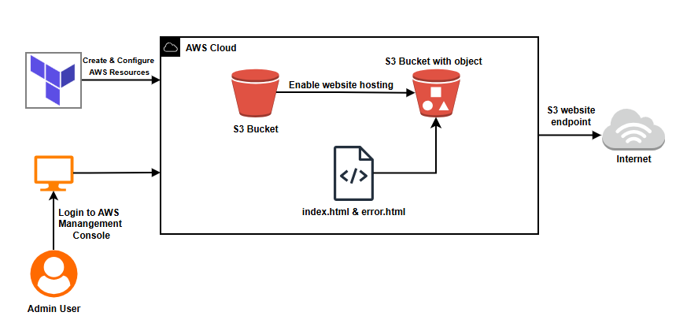

# Hosting-Static-Website-Using-Terraform

In this project, I built a simple yet effective infrastructure for hosting a static website using **Terraform** and **Amazon Web Services (AWS) S3**.

My main objective was to demonstrate how Infrastructure as Code (IaC) can be applied to automate the provisioning, configuration, and deployment of a static website hosting environment.


=======
# Hosting a Static Website on AWS S3 Using Terraform

A Terraform project that provisions an AWS S3 bucket configured for static website hosting and automatically uploads the website files.



---

## Project Structure

```
Hosting-Static-Website-Using-Terraform/
├── provider.tf          # AWS provider and Terraform version config
├── variables.tf         # Input variables (region, bucket name, file names)
├── s3.tf                # S3 bucket, website config, policy, and file uploads
├── outputs.tf           # Outputs the website endpoint URL
└── websiteFiles/
    ├── index.html       # Main website page (Cloud Computing overview)
    └── error.html       # Custom 404 error page
```

---

## Resources Created

| Resource | Description |
|---|---|
| `aws_s3_bucket` | S3 bucket to host the website |
| `aws_s3_bucket_website_configuration` | Enables static website hosting |
| `aws_s3_bucket_policy` | Grants public read access (`s3:GetObject`) |
| `aws_s3_bucket_public_access_block` | Disables public access blocks for hosting |
| `aws_s3_object` (x2) | Uploads `index.html` and `error.html` |

---

## Prerequisites

- [Terraform](https://developer.hashicorp.com/terraform/downloads) >= 1.0
- [AWS CLI](https://docs.aws.amazon.com/cli/latest/userguide/install-cliv2.html) configured with valid credentials
- An AWS account with permissions to manage S3

---

## Variables

| Variable | Description | Default |
|---|---|---|
| `aws_region` | AWS region to deploy resources | `eu-central-1` |
| `bucket_name` | S3 bucket name (must be globally unique) | `abm-static-website` |
| `index_file` | Index document filename | `index.html` |
| `error_file` | Error document filename | `error.html` |

---

## Usage

**1. Clone the repository**
```bash
git clone <repo-url>
cd Hosting-Static-Website-Using-Terraform
```

**2. Initialize Terraform**
```bash
terraform init
```

**3. Preview the plan**
```bash
terraform plan
```

**4. Apply the configuration**
```bash
terraform apply
```

**5. Access your website**

After apply completes, Terraform outputs the website URL:
```
website_endpoint = "abm-static-website.s3-website.eu-central-1.amazonaws.com"
```

Open the URL in your browser to view the site.

**6. Destroy resources**
```bash
terraform destroy
```

---

## Outputs

| Output | Description |
|---|---|
| `website_endpoint` | The public S3 static website URL |

---

## Security Notes

> ⚠️ This project intentionally makes the S3 bucket **publicly readable** to serve a static website. This is required for S3 static website hosting without CloudFront.

For a production setup, consider:
- Serving via **CloudFront** with an Origin Access Control (OAC) to keep the bucket private
- Enabling **S3 server access logging**
- Restricting the bucket policy to specific IP ranges or CloudFront distributions

---

## Provider

- AWS Provider: `hashicorp/aws ~> 6.12.0`
